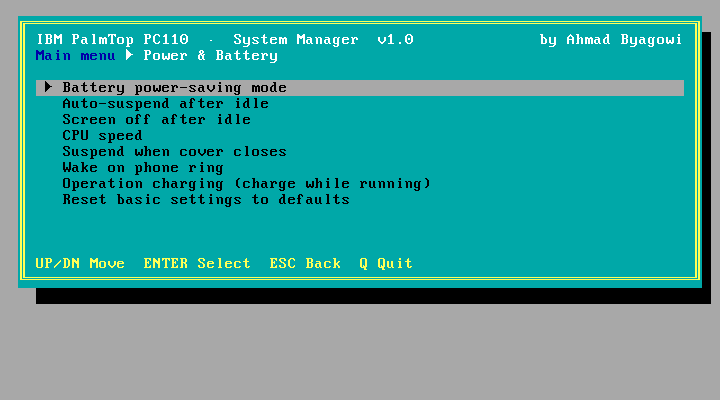
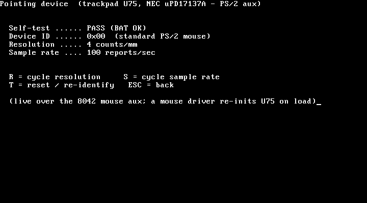

# PS2TUI 
## A text-UI system manager for the IBM PalmTop PC110

*Version 1.0 · by Ahmad Byagowi*


*The PS2TUI main menu — categorised, framed, keyboard-driven (captured in QEMU).*

`PS2TUI` is a full-screen, keyboard-driven front-end for configuring the **IBM PalmTop PC110**
(type 2431, 1995). It replaces the ~50 cryptic switches of IBM's `PS2.EXE` command-line tool with
a **two-level menu** — pick a category, then a setting — and it reads the machine's live state
(battery, current settings) **natively** via the APM BIOS and CMOS.

It is a tiny (~5 KB) real-mode DOS `.COM`, hand-written in assembly, with **no dependencies** —
it runs on the PC110's PC DOS 7 / MS-DOS. It was developed and tested on **real PC110 hardware**.

### Organised into sub-menus

The top level is a set of categories with one-line descriptions; **Enter** opens a category, **ESC**
steps back. A framed panel, a title/breadcrumb bar and a context-sensitive footer give it a clean,
consistent feel throughout.

```
 IBM PalmTop PC110  ·  System Manager                        by Ahmad Byagowi
 Main menu
 ╔════════════════════════════════════════════════════════════════════════╗
 ║  ► Power & Battery      Power saving, CPU speed, charging               ║
 ║    Display             LCD / CRT output, vertical stretch               ║
 ║    Devices             Audio, digitizer, IR / serial / modem           ║
 ║    Keyboard & Pointer  Click, repeat rate, trackpad settings           ║
 ║    Advanced            LPT, ATA, PCMCIA, battery, token-ring           ║
 ║    Dumps & ROM         BIOS / video-BIOS / font-ROM images             ║
 ║    System Test         RAM, video, keyboard, speaker, clock            ║
 ║    Diagnostics         Live hardware probes & chipset config           ║
 ║    Backup & Restore    Save / restore all CMOS settings                ║
 ║    Information         Battery, settings, firmware revisions           ║
 ╚════════════════════════════════════════════════════════════════════════╝
 UP/DN Navigate   ENTER Open   B Battery  C Settings  R Revisions   ESC/Q Quit
```



*A category sub-menu (Main menu ► Power & Battery), with the value picker.*

## Menu tree

Every screen expanded — 10 categories, 57 items, with each value picker's choices shown as
leaves. Choosing any picker value opens a **Run? (Y/N)** confirm before it is applied. `[native]`
items run directly in PS2TUI (no `PS2.EXE`); `!` marks disruptive actions.

```
IBM PalmTop PC110 — System Manager
│
├─ Power & Battery
│   ├─ Battery power-saving mode
│   │   ├─ High
│   │   ├─ Medium
│   │   └─ Low
│   ├─ Auto-suspend after idle  (minutes)
│   │   ├─ 0
│   │   ├─ 1
│   │   ├─ 3
│   │   ├─ 5
│   │   ├─ 10
│   │   ├─ 15
│   │   ├─ 30
│   │   ├─ 60
│   │   └─ 99
│   ├─ Screen off after idle  (minutes)
│   │   ├─ 0
│   │   ├─ 1
│   │   ├─ 3
│   │   ├─ 5
│   │   ├─ 10
│   │   ├─ 15
│   │   └─ 17
│   ├─ CPU speed
│   │   ├─ Fast
│   │   ├─ Medium
│   │   └─ Slow
│   ├─ Suspend when cover closes
│   │   ├─ Enable
│   │   └─ Disable
│   ├─ Wake on phone ring
│   │   ├─ Enable
│   │   └─ Disable
│   ├─ Operation charging (while running)  [ULTRACHG.COM]
│   │   ├─ Enable
│   │   └─ Disable
│   └─ Reset basic settings to defaults  [action]
│       └─ (then: Run? Y/N)
│
├─ Display
│   ├─ Display output
│   │   ├─ LCD
│   │   └─ CRT
│   └─ Stretch display (vertical expand)
│       ├─ ON
│       └─ OFF
│
├─ Devices
│   ├─ SoundBlaster IRQ
│   │   ├─ 5
│   │   ├─ 10
│   │   └─ Disable
│   ├─ SoundBlaster DMA
│   │   ├─ 1
│   │   └─ 3
│   ├─ SoundBlaster I/O address
│   │   └─ 0220
│   ├─ Digitizer (inking) IRQ
│   │   ├─ 5
│   │   ├─ 10
│   │   └─ Disable
│   ├─ Digitizer (inking) I/O address
│   │   ├─ 15E0
│   │   ├─ 25E0
│   │   └─ 35E0
│   ├─ Infrared port
│   │   ├─ COM1
│   │   ├─ COM2
│   │   └─ Off
│   ├─ Serial port
│   │   ├─ COM1
│   │   ├─ COM2
│   │   └─ Off
│   ├─ Internal modem port
│   │   ├─ COM1
│   │   ├─ COM2
│   │   └─ Off
│   └─ PCMCIA modem port
│       ├─ COM1
│       ├─ COM2
│       └─ Off
│
├─ Keyboard & Pointer
│   ├─ Keyboard click sound
│   │   ├─ ON
│   │   └─ OFF
│   ├─ Keyboard typematic rate
│   │   ├─ Med
│   │   └─ Fast
│   ├─ Keyboard typematic delay
│   │   ├─ Normal
│   │   └─ Long
│   ├─ Keyboard device select
│   │   ├─ Auto
│   │   └─ Both
│   └─ Pointing device (identify + settings)  [native · 8042 aux → trackpad U75]
│       ├─ Self-test + device ID + resolution + sample rate (shown live)
│       ├─ R  = cycle resolution:  1 / 2 / 4 / 8 counts/mm
│       ├─ S  = cycle sample rate: 10 / 20 / 40 / 60 / 80 / 100 / 200 /s
│       ├─ T  = reset / re-identify
│       └─ ESC = back
│
├─ Advanced
│   ├─ Parallel port mode
│   │   ├─ BI
│   │   ├─ UNI
│   │   ├─ ECP
│   │   └─ EPP
│   ├─ IDE/ATA controller order
│   │   ├─ Primary
│   │   └─ Secondary
│   ├─ PCMCIA controller
│   │   ├─ Enable
│   │   └─ Disable
│   ├─ Support 3V PCMCIA cards
│   │   ├─ Enable
│   │   └─ Disable
│   ├─ LCD status panel shows
│   │   ├─ Auto
│   │   ├─ Time
│   │   └─ Battery
│   ├─ Battery charge profile
│   │   ├─ Standard
│   │   └─ Other
│   ├─ Floppy power management
│   │   ├─ Enable
│   │   └─ Disable
│   ├─ IRQ clear
│   │   ├─ Enable
│   │   └─ Disable
│   ├─ Token-ring RIPL speed
│   │   ├─ 4Mbps
│   │   └─ 16Mbps
│   └─ ! COMB serial-mux device
│       ├─ RS232
│       ├─ IRda
│       ├─ MIDI
│       └─ ASK
│
├─ Dumps & ROM
│   ├─ Dump system BIOS  → C:\PC110BIO.BIN   [native · F000, 64 KB]
│   ├─ Dump video BIOS   → C:\PC110VID.BIN   [native · C000, 32 KB]
│   └─ Dump font ROM     → C:\PC110FNT.BIN   [native · 1 MB, 128 banks]
│
├─ System Test
│   ├─ Memory info + RAM test          [native · conv/ext size + pattern]
│   ├─ Video / colour test             [native · 16 fg / 8 bg / charset]
│   ├─ Keyboard test                   [native · scancode/ascii]
│   ├─ Speaker test (beep)             [native · PIT ch2 ~1 kHz]
│   ├─ Real-time clock test (live)     [native · RTC ticking]
│   ├─ Timer (PIT) test                [native · ~18.2 Hz]
│   └─ Pointing device test            [native · INT 33h]
│
├─ Diagnostics
│   ├─ Hardware scan / report          [native · CPU/mem/APM/SCAMP/MCU/PCIC/font/UART/RTC]
│   ├─ Storage / disk info + read test [native · INT 13h geometry + sector 0]
│   ├─ Power / battery MCU detail      [native · 0xEC/0xED register file]
│   ├─ PCMCIA socket status            [native · 0x3E0/0x3E1 PCIC]
│   └─ Chipset config (VL82C420)      [native · SCAMP 0x74/0x76, unlocked]
│
├─ Backup & Restore
│   ├─ Backup all settings  → C:\PC110SET.BIN   [native · CMOS 0x10-0x7F]
│   └─ Restore all settings ← C:\PC110SET.BIN   [native]
│       └─ confirm Y/N → effective next boot
│
└─ Information
    ├─ Battery / AC status (live)      [native · APM INT 15h]
    ├─ Current settings (live)         [native · CMOS 0x70/0x71]
    ├─ Show firmware revisions         [PS2 _@REVision]
    ├─ ! Suspend the PC110 now  [action]
    │   └─ (then: Run? Y/N)
    ├─ ! Power OFF the PC110 now  [action]
    │   └─ (then: Run? Y/N)
    └─ ! Reset ALL advanced settings  [action]
        └─ (then: Run? Y/N)

Global keys:  B Battery · C Settings · R Revisions · Q Quit · ESC Back/Quit
```

## Features

- **Menu for every PS2 setting** — power management, CPU speed, display, SoundBlaster and
  digitizer resources, COM-port routing, keyboard, parallel port, PCMCIA, battery, and the
  hidden `_@` advanced options (including the **undocumented `ADDAUdio`** SoundBlaster-address
  command) — grouped into categories and applied with a confirm step.
- **ROM / memory dumps** — write byte-perfect images to the boot drive: **system BIOS**
  (`PC110BIO.BIN`, 64 KB), **video BIOS** (`PC110VID.BIN`, 32 KB) and the **1 MB banked font ROM**
  (`PC110FNT.BIN`) — done natively (direct memory read + font-ROM bank switching), no external tool.
- **System test menu** (Easy-Setup style) — RAM pattern test + memory sizes, video/colour test,
  interactive keyboard test, speaker beep test, a **live real-time-clock** test, a **PIT timer**
  test, and a **pointing-device** test (INT 33h, vector-guarded).
- **Hardware diagnostics** (Diagnostics menu):
  - **Hardware scan** — a one-screen live probe of every subsystem: CPU (CPUID vendor /
    family-model-stepping / FPU), conventional + extended memory, APM + battery, the SCAMP
    VL82C420, the power MCU, the PCMCIA PCIC (chip ID), the banked font ROM (signature check),
    the COM1 UART, and the RTC — each reported *present/absent* from a real port read.
  - **Storage / disk** — INT 13h drive geometry (cyl/heads/sectors) + a sector-0 read test.
  - **Power / battery MCU detail** — dumps the power-MCU register file (`0xEC/0xED`, live
    battery/thermal telemetry).
  - **PCMCIA socket status** — reads the PCIC and shows each socket's card-present state.
  - **Chipset config (VL82C420)** — dumps the **SCAMP config space** live. That register bank
    reads all-`FF` after POST because the BIOS locks it (the `0x22/0x23` gate); PS2TUI re-opens the
    gate, reads all 128 indices, and re-locks — **atomically**, since it re-locks between bus cycles.
    The `SL` signature at idx 0x7A/0x7B confirms the read. (See
    [Discovery/Chipset §13a](https://github.com/ahmadexp/Open-Source-PC110/tree/main/Discovery/Chipset).)
  - **Pointing device (identify + settings)** — talks to the trackpad MCU (**U75, NEC µPD17137A**)
    over its only host interface, the **8042 PS/2 aux channel**: runs a reset/self-test, shows the
    device ID and the live **resolution** and **sample rate**, and lets you cycle those settings on
    screen (`R`/`S`) or re-identify (`T`). It brings the aux channel up on entry and **restores the
    8042 command byte on exit**. (The MCU's firmware is internal mask ROM and is *not* host-dumpable —
    see [Discovery/Trackpoint](https://github.com/ahmadexp/Open-Source-PC110/tree/main/Discovery/Trackpoint).)

    
- **Operation charging** (Power menu) — enable/disable charging *while the machine runs*, by
  invoking the `ULTRACHG.COM` "operation charge" utility. See how it works in
  [Discovery/ULTRACHG](https://github.com/ahmadexp/Open-Source-PC110/tree/main/Discovery/ULTRACHG)
  (it drives the PC110 embedded-controller mailbox at `0x15E8/0x15EC` with a `Zn10`/`Zn00` command).
- **Backup / restore all settings** — save every CMOS-stored setting to `PC110SET.BIN` and write it
  back later. It images the whole CMOS config region (`0x10–0x7F`, both checksums included), so the
  backup is self-consistent; restore asks for confirmation and takes effect on the next boot.
- **Live battery / AC status** (`B`) — read natively from the **APM BIOS**
  (`INT 15h AX=5300`/`530A`). Shows AC line, battery state and charge %.
- **Live current settings** (`C`) — read natively straight from **CMOS** (`ports 0x70/0x71`):
  keyboard click, LCD status-panel mode, power-saving mode, vertical-expand.
- **Firmware revisions** (`R`) — BIOS / APM / VGA / SETUP-DIAG / keyboard-MCU / power-MCU / PS2.

### Diagnostics on a real PC110

```
Hardware diagnostics  (live probe)

  CPU ............ GenuineIntel  fam 4 mdl 2 stp 11  FPU: no
  Memory ......... 640 KB  ext 19456 KB
  APM BIOS ....... present  batt 100%
  SCAMP VL82C420 . present
  Power MCU (U6) . present
  PCMCIA PCIC .... present  id 0x83
  Font ROM ....... signature OK (55AA/FONT)
  COM1 UART ...... present
  RTC / CMOS ..... battery OK, no POST errors
```
*(Captured from a real IBM PC110 — the CPU reports as the Intel 486SX, family 4 / model 2 /
stepping 11, no FPU.)*

## Keys

| Key | Action |
|---|---|
| ↑ / ↓ | Move the selection (category on the main menu, setting inside a sub-menu) |
| Enter | On the main menu: **open** the category. In a sub-menu: **open the picker / run** the item |
| (in picker) ↑/↓ + Enter | Choose a value → confirm with **Y** / cancel with **N** |
| ESC | **Back** one level (sub-menu → main menu); on the main menu it **quits** |
| **B** | Battery / AC status, read live from APM (also in *Information*) |
| **C** | Current settings, read live from CMOS (also in *Information*) |
| **R** | Firmware revision manifest (also in *Information*) |
| **Q** | Quit to DOS from anywhere |

## How it works

PS2TUI does the **read** paths itself (APM `INT 15h`, CMOS `0x70/0x71`) — no external tool needed
to show live state. For **applying** a setting it invokes IBM's own `PS2.EXE` (which must be on the
machine, e.g. `C:\PS2.EXE`), so the actual, tested hardware/BIOS work is done by IBM's utility.
The reverse-engineering behind this — the APM vendor calls, the bitfield encodings, and where the
settings live in CMOS — is documented in the
[Open-Source-PC110](https://github.com/ahmadexp/Open-Source-PC110) project under `Discovery/PS2`.

> Setting *serial / IR / modem* ports or *suspend / power-off* can change how the machine behaves
> (and could drop a serial console). PS2TUI marks the disruptive actions with a leading `!` and
> always shows the exact command and a confirm prompt before running it.

## Command coverage

PS2TUI's menu covers **every enumerated `PS2.EXE` command** (basic and hidden `_@` ones):
power management, CPU speed, display, audio/digitizer resources, COM-port routing, keyboard,
parallel port, ATA/PCMCIA, battery, token-ring, COMB mux, IRQ-clear, and the reset/off actions.
It also includes **`ADDAUdio`** (SoundBlaster I/O address `0220`) — a command that is present in
`PS2.EXE`'s keyword table but is **undocumented**: it appears in neither the built-in `?` / `_@???`
help nor the public command references.

Three commands are **not** in the menu because they need free-form input rather than a fixed set
of choices (a text-entry field is planned):

- `ON AT <date/time>` — set a wake-on-time alarm
- `_@CMOS [OR|AND|XOR] xxH[=yyH]` — direct CMOS read/modify
- `_@FNkey NN[=YY]` — send an Fn key code

## Building

Requires [NASM](https://nasm.us). The prebuilt `PS2TUI.COM` in this repo is the
hardware-tested binary.

```sh
make            # or:  nasm -f bin PS2TUI.ASM -o PS2TUI.COM
```

There is no linker step — the source assembles directly to a flat DOS `.COM`. The menu is fully
**data-driven**: edit the `rows` table near the top of `PS2TUI.ASM` to add or change entries.

## Installing / running

Copy `PS2TUI.COM` to the PC110 (any directory) and run it:

```
PS2TUI
```

## License

[CC BY-NC 4.0](LICENSE), matching the parent
[Open-Source-PC110](https://github.com/ahmadexp/Open-Source-PC110) project.
