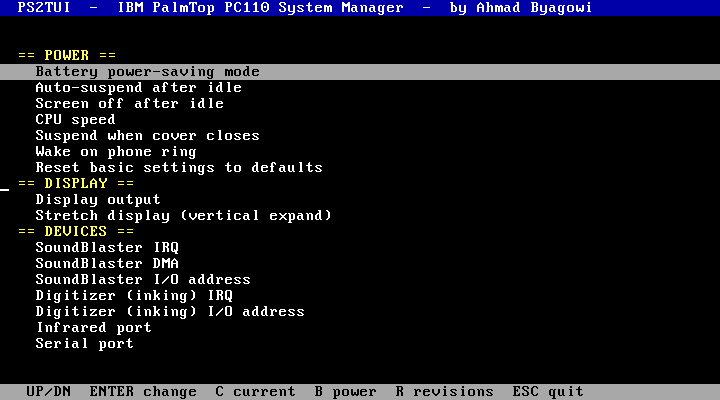

# PS2TUI 
## A text-UI system manager for the IBM PalmTop PC110

*by Ahmad Byagowi*



*PS2TUI running (captured in QEMU booting PC DOS 7).*

`PS2TUI` is a full-screen, keyboard-driven front-end for configuring the **IBM PalmTop PC110**
(type 2431, 1995). It replaces the ~50 cryptic switches of IBM's `PS2.EXE` command-line tool with
a navigable menu, and it reads the machine's live state (battery, current settings) **natively**
via the APM BIOS and CMOS.

It is a tiny (~4.6 KB) real-mode DOS `.COM`, hand-written in assembly, with **no dependencies** —
it runs on the PC110's PC DOS 7 / MS-DOS. It was developed and tested on **real PC110 hardware**.

```
  PS2TUI  -  IBM PalmTop PC110 System Manager  -  by Ahmad Byagowi

  == POWER ==
    Battery power-saving mode
    Auto-suspend after idle          +-------------------+
    Screen off after idle            | Choose value:     |
    CPU speed                 <------ | Fast              |
    Suspend when cover closes        | Medium            |
    Wake on phone ring               | Slow              |
    Reset basic settings to defaults +-------------------+
  == DISPLAY ==
    Display output
    Stretch display (vertical expand)
  == DEVICES ==
    SoundBlaster IRQ / DMA
    Digitizer (inking) IRQ / address
    Infrared / Serial / Modem ports
  == KEYBOARD / ADVANCED / INFO ==
    ...
   UP/DN  ENTER change  C current  B power  R revisions  ESC quit
```

## Features

- **Menu for every PS2 setting** — power management, CPU speed, display, SoundBlaster and
  digitizer resources, COM-port routing, keyboard, parallel port, PCMCIA, battery, and the
  hidden `_@` advanced options (including the **undocumented `ADDAUdio`** SoundBlaster-address
  command) — grouped into categories and applied with a confirm step.
- **ROM / memory dumps** — write byte-perfect images to the boot drive: **system BIOS**
  (`PC110BIO.BIN`, 64 KB), **video BIOS** (`PC110VID.BIN`, 32 KB) and the **1 MB banked font ROM**
  (`PC110FNT.BIN`) — done natively (direct memory read + font-ROM bank switching), no external tool.
- **System test menu** (Easy-Setup style) — memory info + RAM pattern test, video/colour test,
  interactive keyboard test, and a speaker beep test.
- **Operation charging** (Power menu) — enable/disable charging *while the machine runs*, by
  invoking the `ULTRACHG.COM` "operation charge" utility. See how it works in
  [Discovery/ULTRACHG](https://github.com/ahmadexp/Open-Source-PC110/tree/main/Discovery/ULTRACHG)
  (it drives the PC110 embedded-controller mailbox at `0x15E8/0x15EC` with a `Zn10`/`Zn00` command).
- **Backup / restore all settings** — save every CMOS-stored setting to `PC110SET.BIN` and write it
  back later. It images the whole CMOS config region (`0x10–0x7F`, both checksums included), so the
  backup is self-consistent; restore asks for confirmation and takes effect on the next boot.
- **Live battery / AC status** (`B`) — read natively from the **APM BIOS**
  (`INT 15h AX=5300`/`530A`). Shows AC line, battery state and charge %.
- **Live current settings** (`C`) — read natively straight from **CMOS** (`ports 0x70/0x71`):
  keyboard click, LCD status-panel mode, power-saving mode, vertical-expand.
- **Firmware revisions** (`R`) — BIOS / APM / VGA / SETUP-DIAG / keyboard-MCU / power-MCU / PS2.

## Keys

| Key | Action |
|---|---|
| ↑ / ↓ | Move between settings (category headers are skipped) |
| Enter | Open the value picker (or run an action), then confirm with **Y** / cancel with **N** |
| **C** | Current settings, read live from CMOS |
| **B** | Battery / AC status, read live from APM |
| **R** | Firmware revision manifest |
| ESC | Quit to DOS |

## How it works

PS2TUI does the **read** paths itself (APM `INT 15h`, CMOS `0x70/0x71`) — no external tool needed
to show live state. For **applying** a setting it invokes IBM's own `PS2.EXE` (which must be on the
machine, e.g. `C:\PS2.EXE`), so the actual, tested hardware/BIOS work is done by IBM's utility.
The reverse-engineering behind this — the APM vendor calls, the bitfield encodings, and where the
settings live in CMOS — is documented in the
[Open-Source-PC110](https://github.com/ahmadexp/Open-Source-PC110) project under `Discovery/PS2`.

> Setting *serial / IR / modem* ports or *suspend / power-off* can change how the machine behaves
> (and could drop a serial console). PS2TUI marks the disruptive actions with a leading `!` and
> always shows the exact command and a confirm prompt before running it.

## Command coverage

PS2TUI's menu covers **every enumerated `PS2.EXE` command** (basic and hidden `_@` ones):
power management, CPU speed, display, audio/digitizer resources, COM-port routing, keyboard,
parallel port, ATA/PCMCIA, battery, token-ring, COMB mux, IRQ-clear, and the reset/off actions.
It also includes **`ADDAUdio`** (SoundBlaster I/O address `0220`) — a command that is present in
`PS2.EXE`'s keyword table but is **undocumented**: it appears in neither the built-in `?` / `_@???`
help nor the public command references.

Three commands are **not** in the menu because they need free-form input rather than a fixed set
of choices (a text-entry field is planned):

- `ON AT <date/time>` — set a wake-on-time alarm
- `_@CMOS [OR|AND|XOR] xxH[=yyH]` — direct CMOS read/modify
- `_@FNkey NN[=YY]` — send an Fn key code

## Building

Requires [NASM](https://nasm.us). The prebuilt `PS2TUI.COM` in this repo is the
hardware-tested binary.

```sh
make            # or:  nasm -f bin PS2TUI.ASM -o PS2TUI.COM
```

There is no linker step — the source assembles directly to a flat DOS `.COM`. The menu is fully
**data-driven**: edit the `rows` table near the top of `PS2TUI.ASM` to add or change entries.

## Installing / running

Copy `PS2TUI.COM` to the PC110 (any directory) and run it:

```
PS2TUI
```

## License

[CC BY-NC 4.0](LICENSE), matching the parent
[Open-Source-PC110](https://github.com/ahmadexp/Open-Source-PC110) project.
